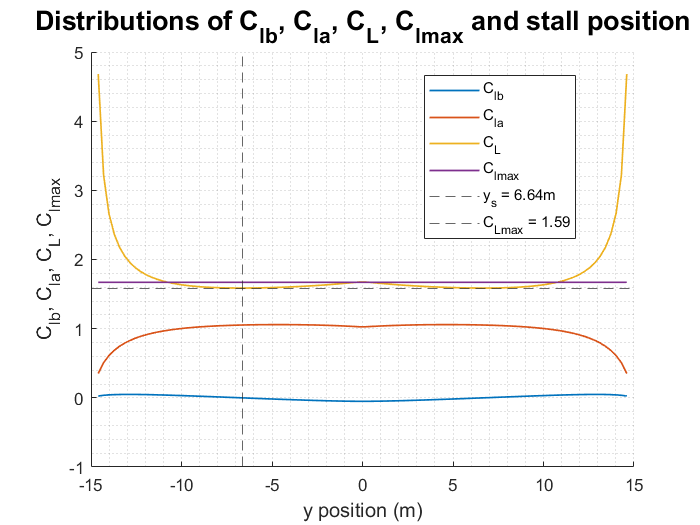

# airplaneWingAnalysis
Program to analyse and represent several aerodynamic properties of an airplane.

## Disclaimer
Lifting line solution section is developed by Enrique Ortega (e.ortega@upc.edu), professor at UPC.

## Results
The code could generate a 

_The stability margin is 0.3467._
_CMcg at design lift is -0.5296._
_Stall speed is 95.73._
_Stall position is at -0.45 from root._
_Maximum CL is 1.59._
_SCL margin at SF=1 is 26.73._
_Safety factors are: 1.0, 1.1, 1.2._
  _AOAs are 12.46º, 13.82º, 15.18º._
  _CDs are 0.04812, 0.05918, 0.07152._

Also, it gives up to 20+ plots on the wing's behaviour, like the one below on lift coefficient distributions.

